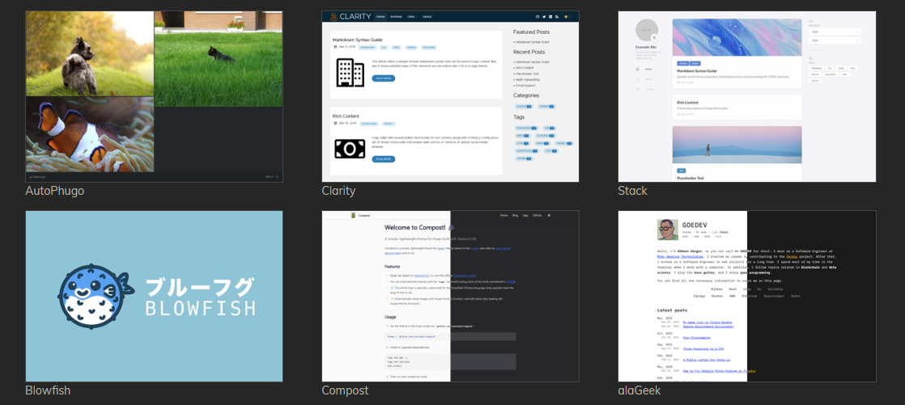
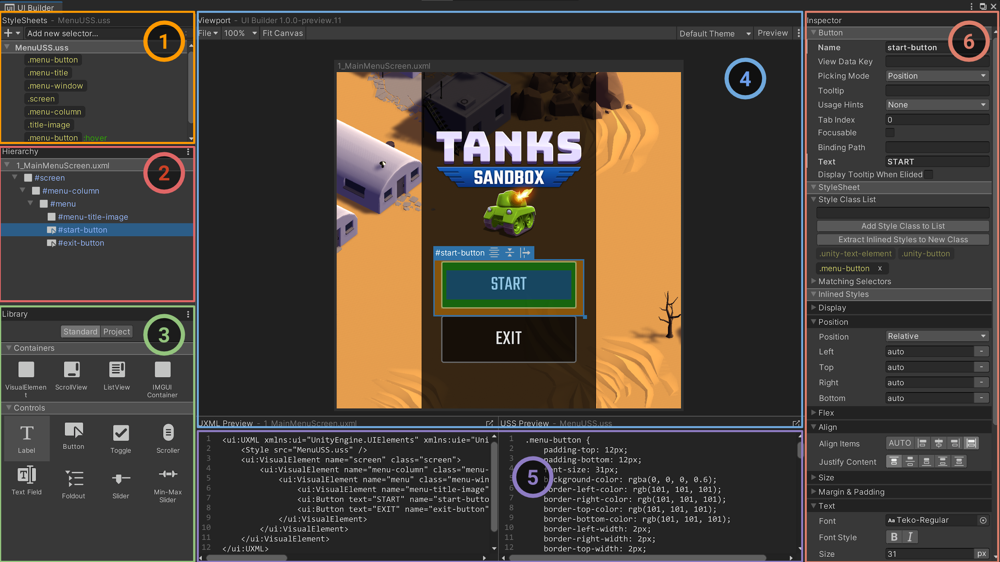

I am not a web developer. The last time I made a website for myself, I took out a CSS textbook from my University library, and built it in notepad.exe. Recently I catch glimpses of the web development world through [fireship.io YouTube videos](https://youtu.be/pEfrdAtAmqk). They scare me.

But I do like markdown and YAML. I actually [love using markdown for all my note-taking](https://obsidian.md/). So when I started getting curious about creating a landing page for myself - with the discourse of an impending twitter diaspora in mind - I remembered hearing about HuGo; A "Static Site Generator" that would turn markdown files into pages. Much more my speed, if I can just get over the setup hurdle.

The first-page-result tutorial I found was ["Create a website with Hugo and GitHub Pages"](https://4bes.nl/2021/08/29/create-a-website-with-hugo-and-github-pages/), which got me up and running shockingly fast. If you want to set up a simple website yourself, I can recommend HUGO and GitHub for quick results! However, as a non-developer, I tripped over several paint points. If you, like me, fall into the band of "familiar with git, but never touched a terminal" or "Game Dev not Web Dev", then I've made note of some things that would be handy to have had open in a second tab.

### Install Hugo... Using a terminal?
Assuming you follow the tutorial pre-requisites and have VS Code, Git, and GitHub setup, your first speedbump might be installing Hugo through a terminal on windows.

I advise downloading the pre-built binaries from [here](https://github.com/gohugoio/hugo/releases/latest), taking care to grab the *extended* build for your platform. Don't worry about "path variables" if this is a strange term to you. After creating my empty git project, I placed `hugo.exe` in the root of the project directory and in VS Code opened the terminal with `Ctrl + '`. Here you can follow along with tutorial commands by prefixing your inputs with `.\`, e.g. `.\hugo new site .\ --force`.

### Install a theme... But not that one!

Setting up a theme is pretty simple. Just place it in the themes folder, make some small changes to `config.toml` and boom! However making edits to a theme is just **full-on front-end development.** Behind the scenes it's CSS, Post CSS, or SASS. Tailwind, Bootstrap, Netlify? Forestry? And obviously, the whole thing is coded in a mix of HTML 5 and Go that my editor doesn't know what to do with.

My mistake was thinking that I could take elements from one theme, and add them to another. If you are not familiar with the names I threw out in the previous paragraph, then transplanting elements from one theme to another is going to be significant surgery.

The "hello-friend-ng" theme itself is a modification of two other existing themes. So I had to bounce between three GitHub pages to check the documentation for each. It might be "one of the most popular blog themes at the time of writing", according to our guide, but that means popular with people who know what they're doing.

I advise taking a few hours to [try out different themes](https://themes.gohugo.io/) to find something that uses a minimal amount of external libraries and JavaScript, or at least is very close to the functionality you are looking for.


*It's like building a wordpress site in 2004 all over again*

## Submodules and theme overrides

The tutorial I followed, and the readme on many themes, will recommend adding your chosen theme as a submodule to the git repo of your site. This is very useful as a fire and forget way to get any future updates to the theme by pulling any changes to the submodule. However, if your not Git CLI proficient and you want to hack the theme later, you might find this hard to undo, especially without loosing any changes you made to the theme!

A quick tip to get the best of both worlds is to fork the theme to your own github account. A detailed guide on exactly this by Andrew Hoog [can be found here](https://www.andrewhoog.com/post/git-submodule-for-hugo-themes/).

Atlassian has a nice article that collates [a lot of useful Stack Overflow answers regarding submodules here](https://www.atlassian.com/git/articles/core-concept-workflows-and-tips). If you already have installed a theme as a submodule, and want to replace that with your own fork (as I did) Here's the useful bit:

>### How to swap a git submodule with your own fork
>This is a very common workflow: you start using someone else's project as submodule but then after a while you find the need to customize it and tweak it yourself, so you want to fork the project and replace the submodule with your own fork. How is that done?
>
>The submodules are stored in .gitmodules:
>
>```
>$ cat .gitmodules [submodule "ext/google-maps"] path = ext/google-maps url = git://git.naquadah.org/google-maps.git
>```
>You can just edit the url with a text editor and then run the following:
>
>```
>$ git submodule sync
>```
>This updates .git/config which contains a copy of this submodule list (you could also just edit the relevant [submodule] section of .git/config manually).
>

At this point, it's worth watching some breakdown on how HuGo sites are structured, and how the different layout elements like Partials, Posts, and Shortcodes work to generate your site. An important thing to know is that if you want to change how any of these elements work, you don't need to work destructively on the theme. It's possible to copy partials or CSS you want to change into override folders.

## Why bother? or, Web dev is the new UI design.

"Do I really have the time to be spending a week wrapping my head around Hugo and SASS, just to avoid making a linktree account?" Was a thought that came to mind while googling some fairly basic yet confusing CSS concepts. But just a few weeks later I found myself checking out Unity's new UI Builder toolset that started as a way to build editor tools, but is now expanded for runtime use. If you have built UI for applications recently this won't be a surprise, but it's all CSS. It even utilises the same, insanely helpful, browser visualisation of Margins, Borders and Padding.


*Interface Overview from the [UI Builder 1.0.0 Documentation](https://docs.unity3d.com/Packages/com.unity.ui.builder@1.0/manual/uib-interface-overview.html)*

And beyond that, maybe I should get at least a little bit less afraid of using a terminal.